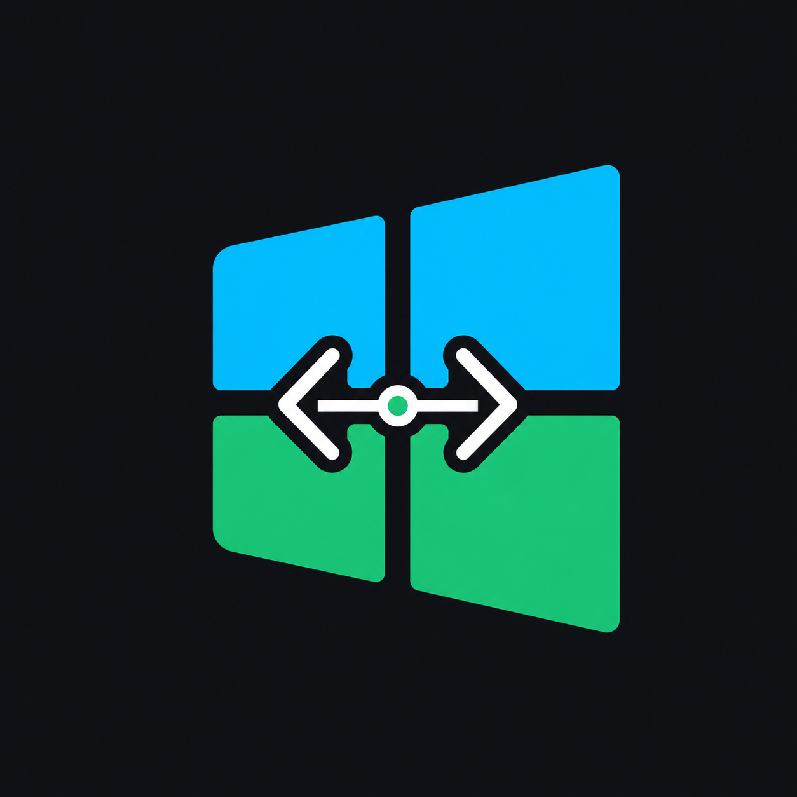

<p align="center">
  
</p>

<h1 align="center">WinLean Coding Skill</h1>

<p align="center">
  <strong>Windows-safe coding agents with leaner context, dependency scouting, and smaller verified patches.</strong>
</p>

<p align="center">
  <a href="README.en.md">English Docs</a> |
  <a href="README.zh-CN.md">Chinese Docs</a> |
  <a href="SKILL.md">SKILL.md</a> |
  <a href="examples/AGENTS.md">AGENTS.md</a>
</p>

<p align="center">
  <a href="https://github.com/ziguishian/winlean-coding-skill/stargazers"></a>
  <a href="https://github.com/ziguishian/winlean-coding-skill/blob/main/LICENSE"></a>
  
  
</p>

<p align="center">
  
</p>

---

WinLean is a reusable Coding Skill for AI code agents working in real Windows repositories: PowerShell, mixed encodings, CRLF/LF, Chinese/emoji/Markdown/prompt files, generated directories, dependency sprawl, and token-heavy overbuilding.

> Clear first, then act. Read less. Patch smaller. Reuse more. Verify every change.

## Why It Exists

AI agents fail in Windows repositories for two boring reasons: brittle shell behavior and oversized implementation habits.

WinLean turns both into a disciplined workflow:

1. Diagnose the OS, shell, encoding, newline, and text risk.
2. Read only files that can change the implementation decision.
3. Check framework capabilities, public libraries, existing dependencies, and project utilities before custom code.
4. Plan the smallest patch.
5. Patch safely, especially around UTF-8 and CRLF/LF.
6. Review the diff and run the smallest useful verification.

## Direct Use

Yes, this repository is enough to use directly.

- Codex-style skill loaders can use the repository root because `SKILL.md` is at the top level.
- `agents/openai.yaml` provides Codex UI metadata.
- `examples/AGENTS.md` can be copied into a project root for instruction-only agents.
- `examples/safe-replace.mjs` and `scripts/validate-skill.mjs` use only Node.js built-ins.
- No npm install is required.

## Install Into Codex

Windows PowerShell:

```powershell
git clone https://github.com/ziguishian/winlean-coding-skill.git "$env:USERPROFILE\.codex\skills\winlean-coding"
```

macOS / Linux:

```bash
git clone https://github.com/ziguishian/winlean-coding-skill.git ~/.codex/skills/winlean-coding
```

Then start a new Codex session:

```text
Use winlean-coding full. Read only relevant files, check dependency options before custom code, make the smallest Windows-safe patch, and verify the diff.
```

## Modes

| mode | use when | behavior |
|---|---|---|
| `lite` | small, low-risk edits | context gate, smallest patch, minimal verification |
| `full` | normal coding work | Windows Safe Mode, Dependency Scout, Safe Patch Agent, Diff Reviewer |
| `audit` | reviewing a plan or diff | no edits; reports Windows risk, token waste, dependency decisions, and overbuilding |

## Compared With Ponytail

[Ponytail](https://github.com/DietrichGebert/ponytail) is a strong lean-coding project with broad agent/plugin coverage and a larger public benchmark. WinLean is narrower by design: it focuses on Windows-safe coding, context discipline, dependency decisions, and UTF-8/LF-safe patching for Codex-style coding agents.

### Token Smoke Result

Same Codex CLI project-build smoke task, same model, same prompt shape, measured on 2026-06-30. Lower is better for token metrics.

| metric | Ponytail | WinLean | result |
|---|---:|---:|---|
| processed input+output | 123,027 | 116,387 | WinLean used 5.4% fewer |
| uncached+output | 18,067 | 16,419 | WinLean used 9.1% fewer |
| output tokens | 6,802 | 6,067 | WinLean used 10.8% fewer |
| reasoning tokens | 3,496 | 2,251 | WinLean used 35.6% fewer |
| generated LOC | 305 | 344 | Ponytail generated fewer LOC |

This is an `n=1` smoke result, not a universal benchmark claim. Ponytail's public benchmark reports strong aggregate savings versus a no-skill baseline; WinLean's measured advantage here is token thrift on this Codex build task plus Windows-specific guardrails.

### Practical Difference

| dimension | Ponytail | WinLean |
|---|---|---|
| Primary goal | Universal minimalism: write only what is needed | Windows-safe minimalism: read less, reuse more, patch smaller, verify |
| Token strategy | Avoid unnecessary code by climbing a minimalism ladder | Block waste before generation: context gate + dependency scout + small patches |
| Windows safety | General agent rules | Explicit PowerShell, UTF-8/GBK/CP936, CRLF/LF, path, and non-ASCII safeguards |
| Dependency decisions | Prefer existing/native/simple options | Adds Public Library Scout and reports dependency decisions explicitly |
| Portability | Broad plugin ecosystem across many agents | Codex-first standalone skill, plus AGENTS.md fallback for other agents |
| Best fit | General overbuilding prevention | Windows repos, multilingual text, prompt/Markdown/i18n edits, precise replacements |

WinLean borrows the best idea from Ponytail: code should justify its existence. It adds the Windows and context-safety layer needed when the problem is not just too much code, but fragile agent execution.

## Star History

<a href="https://www.star-history.com/#ziguishian/winlean-coding-skill&Date">
  <picture>
    <source media="(prefers-color-scheme: dark)" srcset="https://api.star-history.com/svg?repos=ziguishian/winlean-coding-skill&type=Date&theme=dark" />
    <source media="(prefers-color-scheme: light)" srcset="https://api.star-history.com/svg?repos=ziguishian/winlean-coding-skill&type=Date" />
    
  </picture>
</a>

## Use With Other Code Agents

If your agent does not support Codex skills directly:

1. Put this repository somewhere the agent can read.
2. Point the agent at `SKILL.md`.
3. Copy `examples/AGENTS.md` into the target project root if your agent reads project-level instructions.
4. Use `examples/safe-replace.mjs` for exact UTF-8 replacements when needed.

Auto-discovery depends on each agent's conventions, but the content is plain Markdown and can be used by any code agent that accepts project guidance.

## Validate

```bash
node scripts/validate-skill.mjs .
```

Expected output:

```text
WinLean skill validation passed: .
```

## Repository Map

| path | purpose |
|---|---|
| `SKILL.md` | Main skill instructions loaded by Codex |
| `agents/openai.yaml` | Codex UI metadata |
| `assets/winlean-logo.png` | Generated logo used by this README |
| `assets/winlean-banner.png` | Generated banner used by this README |
| `README.en.md` | Full English documentation |
| `README.zh-CN.md` | Full Chinese documentation |
| `examples/AGENTS.md` | Project-root instruction example |
| `examples/safe-replace.mjs` | Safe UTF-8 exact replacement helper |
| `checklists/windows-safe-checklist.md` | Windows safety checklist |
| `checklists/lean-code-checklist.md` | Lean coding checklist |
| `scripts/validate-skill.mjs` | Zero-dependency validator |

## License

MIT. See [LICENSE](LICENSE).